# garden-keeper

An Excalidraw-inspired garden planner and record-keeper.

I wanted a digital and fun way to keep track of my garden; I've handdrawn my landscapes in the past
and labelled my plants to help with layouts. But I don't particularly enjoy this and it's not as friendly
as digital visual editing, when trying to keep track of layouts year-over-year.

Furthermore, like diagramming in software, sometimes it's nice to see plans at a high-level view because it can make you see the concept in a new way.

### Import landscape

<table>
  <tr>
    <td align="center" valign="top" width="33%">
      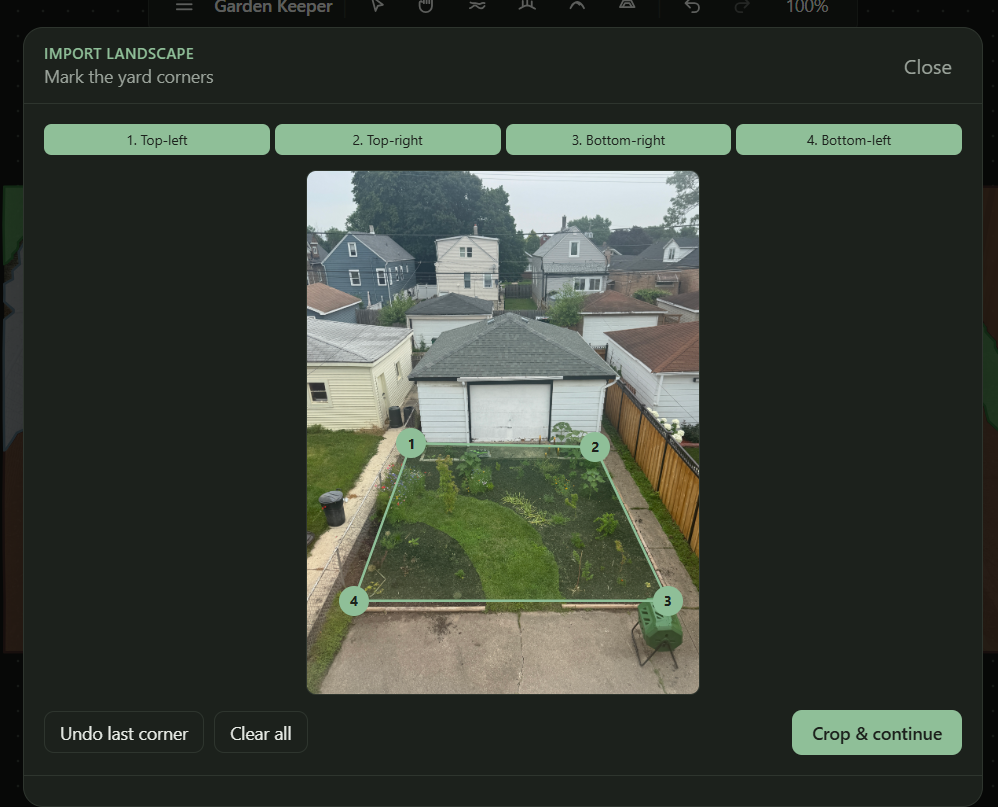
    </td>
    <td align="center" valign="top" width="34%">
      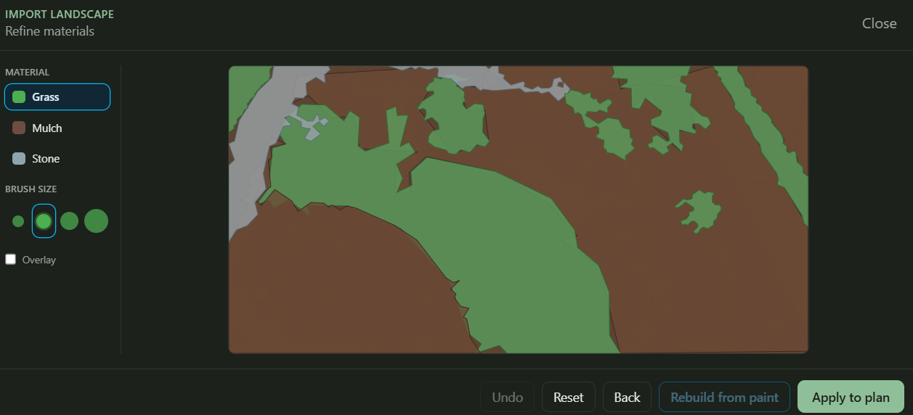
    </td>
    <td align="center" valign="top" width="33%">
      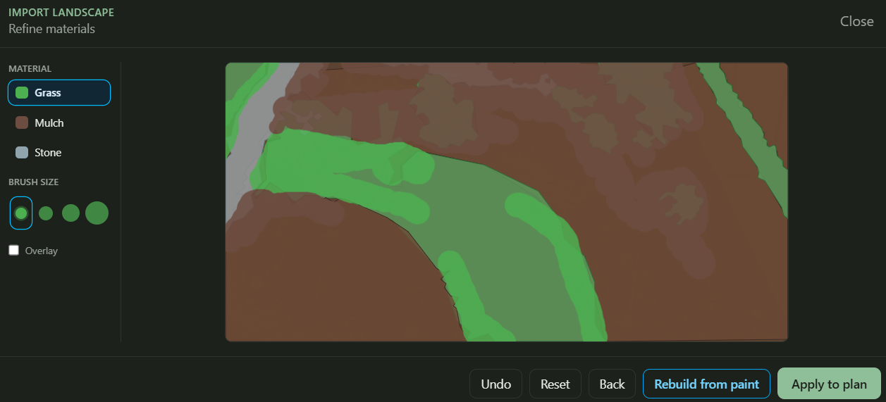
    </td>
  </tr>
  <tr>
    <td align="center" valign="top" width="33%">
      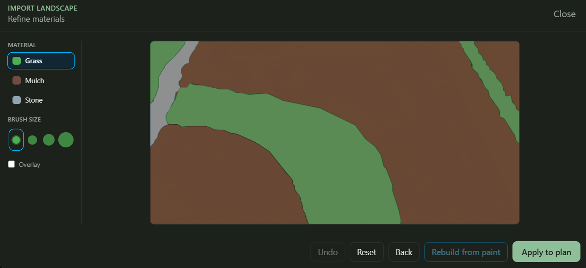
    </td>
    <td align="center" valign="top" width="34%">
      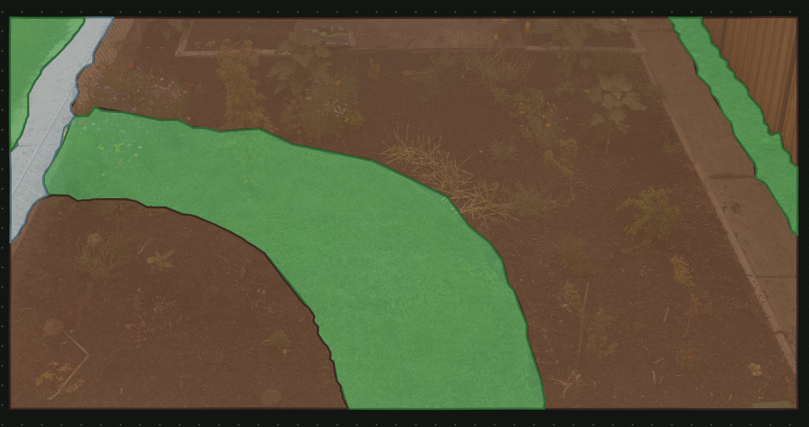
    </td>
    <td></td>
  </tr>
  <tr>
    <td colspan="3" align="center"><em> 1. Uploaded a photo and pinned the 4 corners of the area I want to recreate on the canvas.  2. First pass of OpenCV helps break the image down into 3 colors; green, brown or grey.   3. I manually draw over areas that need correction.    4. Second pass of OpenCV gives me a result I want.  5. Background added to canvas, semi-transparent layer of original photo seen underneath.</em></td>
  </tr>
</table>

### Plant selection

<table>
  <tr>
    <td align="center" valign="top">
      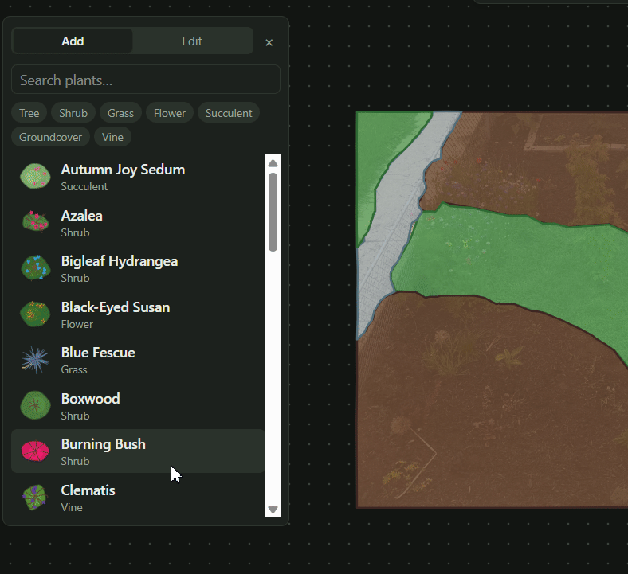
    </td>
  </tr>
  <tr>
    <td align="center"><em>Adding plants to the canvas.</em></td>
  </tr>
</table>

### Japanese maple

The plant options available are not icons like PNGs but vector data stored and rendered. This was chosen to keep plant data uniform and resizeable.

For the most part, I think AI did a good job here, though some things needed some prodding and correction.

<table>
  <tr>
    <td align="center" valign="top">
      
    </td>
  </tr>
  <tr>
    <td align="center"><em>Sonnet 5's first attempt at a japanese maple vector. Yeah, idk either.</em></td>
  </tr>
</table>

### Groundcover as Spray

I wanted groundcovers to not be as segmented like distinct individual plants are (tree, bush, etc.). Because groundcover spreads, it's more about showing how far the groundcover exists in an area. 

Not super satisfied with this result if I were personally using this app but I haven't thought of a better way yet.

<table>
  <tr>
    <td align="center" valign="top">
      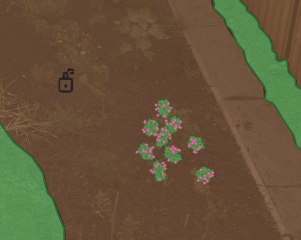
    </td>
  </tr>
  <tr>
    <td align="center"><em>Spraying an area with Creeping Phlox turns it into 1 giant icon upon mouse release (left). Individual clicks are multiple small icons (right).</em></td>
  </tr>
</table>

### Season View & Timeline Player

One thing that I find challenging with landscape planning is trying to find things that will bloom at different points of the year. 

My garden is currently very spring-bloom-heavy; by July, I don't have a lot of things blooming. I'd like to get more summer and fall color.

Additionally, some plants will have color in the winter like the Winterverry or Coral Bark Japanese Maple.

This timeline feature is another reason why I wanted uniform, SVG-based rendering for the plants.

<table>
  <tr>
    <td align="center" valign="top">
      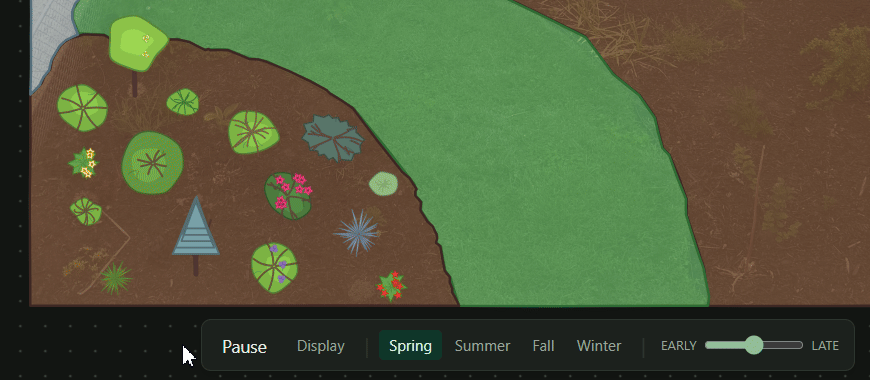
    </td>
  </tr>
  <tr>
    <td align="center"><em>Playing the timeline of plants and how they change foliage/blooms and colors over the seasons.</em></td>
  </tr>
</table>

### Past Progress

#### Corner selection on photo

#### First-pass plant grid

<table>
  <tr>
    <td align="center" valign="top">
      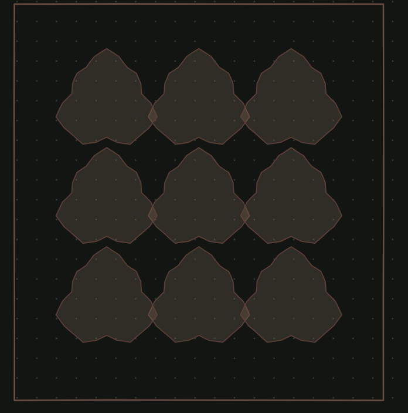
    </td>
  </tr>
  <tr>
    <td align="center"><em>First time the garden photo was sent to OpenCV for rendering.</em></td>
  </tr>
</table>

<table>
  <tr>
    <td align="center" valign="top">
      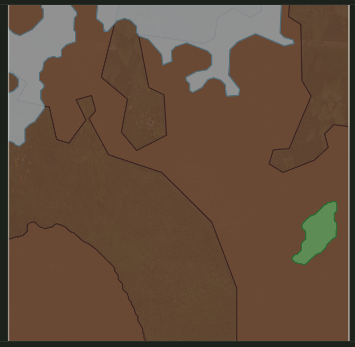
    </td>
  </tr>
  <tr>
    <td align="center"><em>Another early attempt at OpenCV rendering.</em></td>
  </tr>
</table>

<table>
  <tr>
    <td align="center" valign="top">
      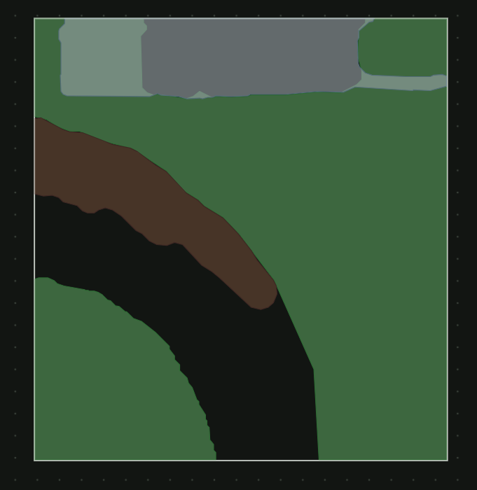
    </td>
  </tr>
  <tr>
    <td align="center"><em>Paint & rebuild feature not working.</em></td>
  </tr>
</table>

<table>
  <tr>
    <td align="center" valign="top">
      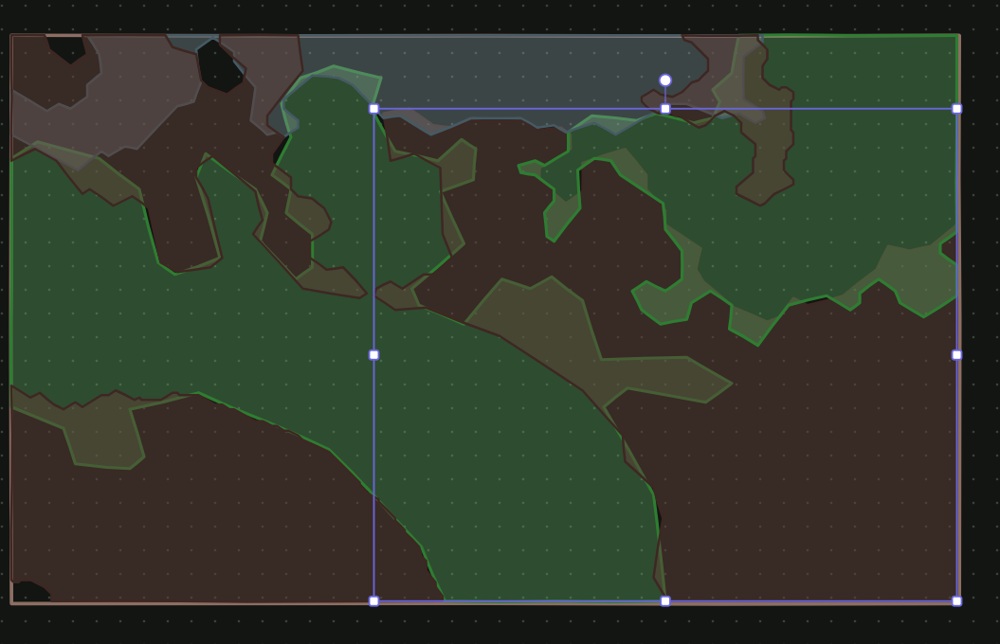
    </td>
  </tr>
  <tr>
    <td align="center"><em>Originally the background layer was not generated into 1 cohesive piece.</em></td>
  </tr>
</table>

<table>
  <tr>
    <td align="center" valign="top">
      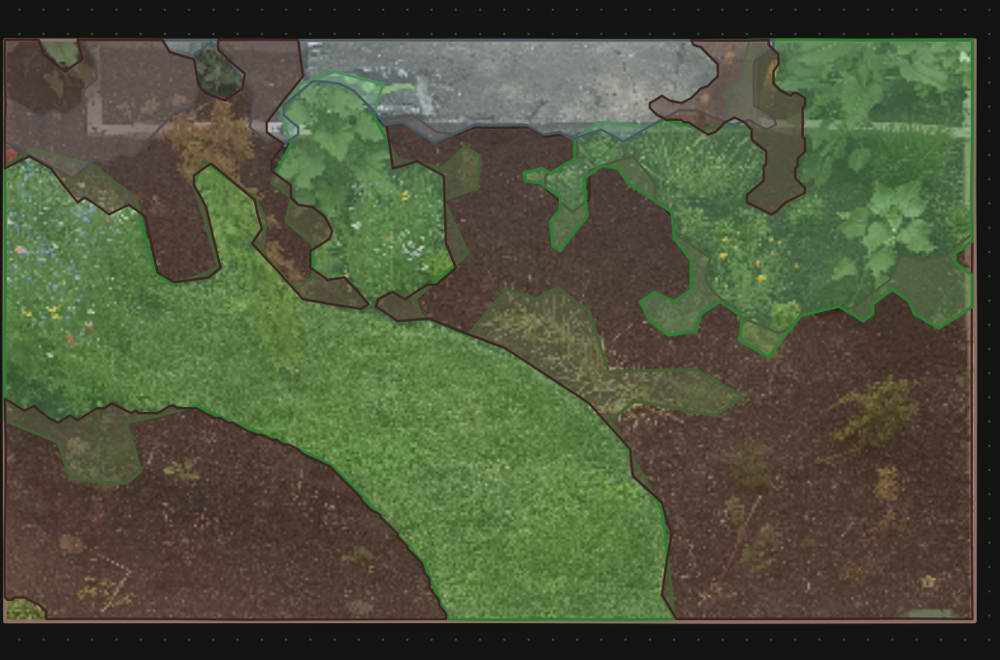
    </td>
  </tr>
  <tr>
    <td align="center"><em>Experimented with distoring selected area to be forced into a more top-down view (now abandoned).</em></td>
  </tr>
</table>